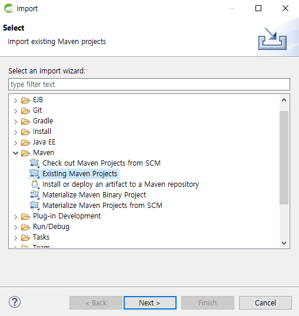

# 처음 설치하는 방법

프론트엔드   (권한 오류 뜨면 쉘을 바꿔서 해보기)

npm install --global yarn

yarn --version

yarn install

yarn serve

---

백엔드 

Existing Maven Projects 로 임포트 하면 bin 안생기고 임포트 가능

1. 실행 오류시 mysql 디비 확인 → mococo 데이터베이스 만들면 됨

---

