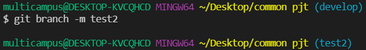

# 처음 설치하는 방법

프론트엔드   (권한 오류 뜨면 쉘을 바꿔서 해보기)

npm install --global yarn

yarn --version

yarn install

yarn serve

---

백엔드 

Existing Maven Projects 로 임포트 하면 bin 안생기고 임포트 가능

1. 실행 오류시 mysql 디비 확인 → mococo 데이터베이스 만들면 됨

---

## git branch &  merge 사용 가이드

### develop에 merge 하는 방법

1. 코드를 수정하기 전에 자신의 local branch를 만들기 (터미널에 git branch -m kiha)

2. 본인의 브런치에서 코드를 수정한 뒤 코드를 git에 add commit push 한다

3. push 후 gitlab에 접속하여 merge하기

##### 같은 파일을 수정해서 충돌이 나는 경우 Merge가 안됨!

- 해결 방법

  1. 둘 중에 하나의 코드만 사용하면 되는 경우 => 두 개 중 하나를 선택하는 방법
  
  

  2. 코드를 다중 선택하는 경우 => 하나만 선택하는 경우에도 적용할 수 있음
  

     코드를 직접 수정할 수 있음 => 만약 하나의 코드를 선택하고 싶다면 해당 코드를 남기고 지우면 됨
     

  3. conflict 해결 후 merge 진행
  

##### 오류가 없는 경우 merge 진행 방법

완료!

4. merge 된 branch를 local에서 pull 받으면 끝

